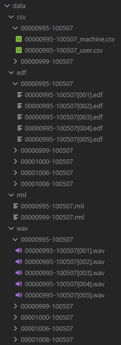

### 本项目为psg数据集下载及提取项目
### 采用url进行下载，使用csv文件记录下载与否来支持断点续跑
### 使用顺序如下：
#### 运行download_dataset.ipynb即可
#### 对每一个id的数据得到结果如下：
##### data/csv/ID/ID_machine.csv 对应数据机器标注的睡眠阶段分类
##### data/csv/ID/ID_user.csv 对应数据人工标注的睡眠阶段分类
##### data/edf/ID/ID[00x].edf 对应数据的edf文件
##### data/rml/ID.rml 对应数据的rml文件
##### data/wav/ID/ID[00x].wav 对应数据的环境麦克风音频wav文件
##### 类似 
